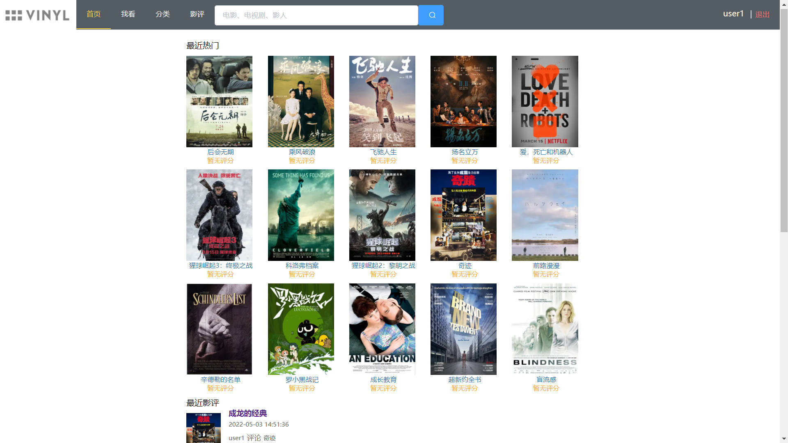
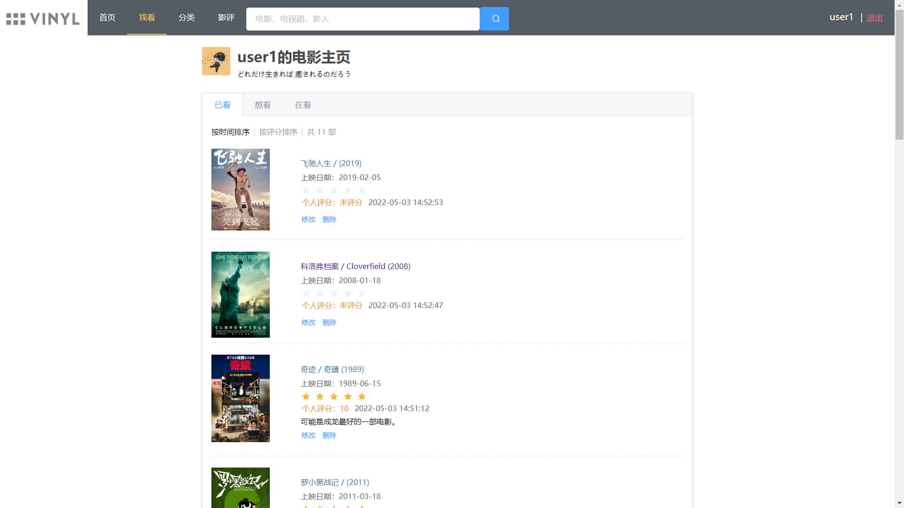
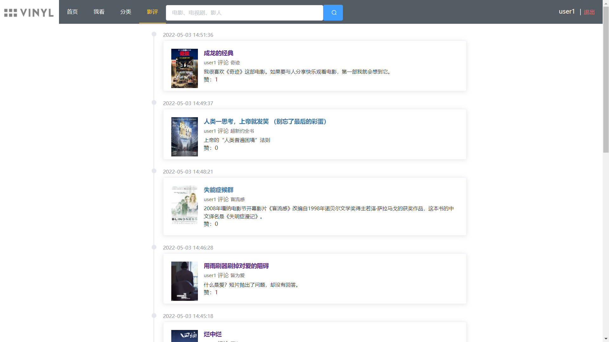
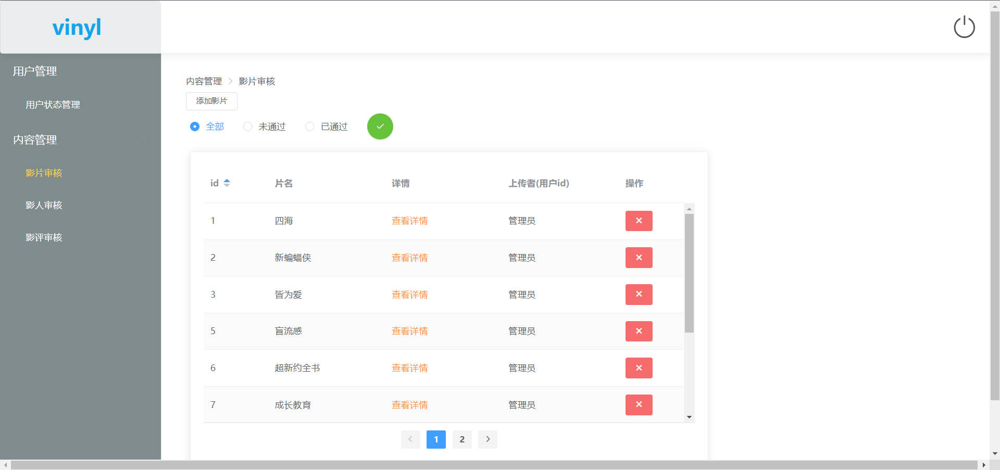

登录
- 用户名密码格式是否合法
- 用户是否存在
- 是否已登录
- 用户是否封禁

注销
- 已登陆

接口

- 管理员
  - isLogin
  - 用户封禁管理
  - 影片审核管理
  - 影人审核管理
  - 影评删除

- 影片列表
  - 时间排序
  - 评分排序

- 我看
  - 看过 watched
    - 数量
    - movielistDTO
      - movieId
      - title/original_title
      - poster
      - date
      - rate
  - 想看
  - 在看
  - 标记影片

- 影片详情页
  - 基本信息
  - 演职员信息
    - 添加信息
  - 短评
    - id
    - 用户名
    - 评分
    - date
    - 短评
  - 影评
    - 影评id
    - avatar
    - 用户id
    - 用户名
    - 描述
    - date

- 根据类型搜索电影
  - 类型多选
  - 给前端返回类型列表
  
- 用户页
  - mark记录
  - 影评
- 影人页
  - 资料
  - 参与影片

- 片名/人物搜索

- 影评/短评点赞

- 影片/演职员关系上传
- 点赞
- 改/删

# 部分截图







# [mysql定时任务](https://cloud.tencent.com/developer/article/1888329)

创建 movie_rate 视图，用于筛选出符合修改条件（有效评分人数>=5）的影片，并算出平均分。

```sql
create view movie_rate
AS
select `user_movie`.`movie_id` AS `movie_id`,avg(`user_movie`.`rate`) AS `avg`,count(`user_movie`.`rate`) AS `count` 
from `user_movie` 
where ((`user_movie`.`rate` <> 0) and (`user_movie`.`status` <> 0)) 
group by `user_movie`.`movie_id` 
having (`count` >= 5)
```

定时任务执行的 SQL	

```sql
update movie,movie_rate 
set movie.rate = movie_rate.avg 
WHERE movie.id = movie_rate.movie_id
```

创建事件，每隔一天更新分数：

```sql
CREATE EVENT `movie_platform`.`update_rate_event`
ON SCHEDULE
EVERY 1 DAY
DO update movie,movie_rate 
set movie.rate = movie_rate.avg 
WHERE movie.id = movie_rate.movie_id;
```

# 部署

spring boot 打包上传服务器，执行

```
java -jar vinyl-back-0.0.1-SNAPSHOT.jar --spring.profiles.active=server
```

axios请求路由：

```
axios.defaults.baseURL = "https://{yourdomain}/api"
```

执行`npm run build` 打包，将 dist 文件夹上传到 nginx 的 html/vinyl目录下

nginx配置：

```
server {
  ...

  location / {
      root html/vinyl/dist;
      try_files $uri $uri/ /index.html last;
      index  index.html index.htm;
  }

  location /api {
      proxy_pass http://localhost:8081/api;
      add_header 'Access-Control-Allow-Origin' '*'; 
      add_header 'Access-Control-Allow-Credentials' 'true'; 
  }
}
```

